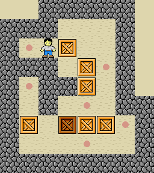

A sokoban game solver
===========================
This project proposed a AI solver for sokoban (japanese for warehouse keeper) which is a difficult computational problem. The algorithm being used consisted of BFS (breadth first search), DFS (depth first search), UCS (uniform cost search) and A* (A star search).

## 目录

* [0. 使用方法](#0)
* [1. 总览](#1)
* [2. 结果对比](#2)

<a id="0"></a>
## 0. 使用方法

1. 需要导入的库有：`sys`，`collections`，`numpy`，`heapq`，`time`。

2. 下载到本地后运行`sokoban.py`文件即可。

### 查看帮助

```
$ python sokoban.py --help
```
```
Usage: sokoban.py [options]

Options:
  -h, --help            show this help message and exit
  -l SOKOBANLEVELS, --level=SOKOBANLEVELS
                        level of game to play (test1-10.txt, level1-5.txt)
  -m AGENTMETHOD, --method=AGENTMETHOD
                        research method (bfs, dfs, ucs, astar)
```

`-l`：地图分为test和level，test的比较简单，level的比较难。
`-m`：搜索算法为bfs，dfs，ucs或astar。

### 运行示例

```
$ python sokoban.py -l test1.txt -m bfs
```
```
rUUdRdrUUluL
Runtime of bfs: 0.15 second.
```
第一行输出为推箱者的动作，`u`，`d`，`l`，`r`分别代表上、下、左、右的移动，对应的大写字母则代表该方向上推着箱子移动。第二行输出为程序的运行时间。

<a id="1"></a>
## 1. 总览

Sokoban，也就是推箱子游戏，[游戏链接](https://www.mathsisfun.com/games/sokoban.html)，玩家需要把所有箱子推到目的地才算成功。

### 地图示例（`level1.txt`）

**图片形式：**



**输入形式：**

```
  #####
###   #
#.&B  #
### B.#
#.##B #
# # . ##
#B XBB.#
#   .  #
######## 
```

其中`#`是墙，`.`是目的地，`B`是箱子（`X`是箱子在目的地上），`&`是推箱子的人（`%`是箱子在目的地上），空白处为可移动空间。

### 思路

搜索算法在这里的使用，简单理解就是当前状态下推箱者采取一个可能动作后，产生下一状态，以此类推，直到最终状态为结束状态。既然用到的是搜索算法，首先要确定的是state space graph（SSG）和search tree（ST）。如果直接把输入的整个地图作为SSG存储在数据结构中，会使内存的占用随搜索的进行而飙升，所以必须重新定义新的SSG，既能减少空间占用，又能代表足够的信息。在推箱子这个问题中，其实关键的部分仅为箱子的位置和人的位置，因为墙和目的地的位置都是不变的。所以定义SSG的样式如下所示，其中第一个tuple代表当前人的坐标，第二个tuple代表当前箱子的坐标。

```
((2, 2), ((2, 3), (3, 4), (4, 4), (6, 1), (6, 4), (6, 5)))
```

而ST就是当前SSG基于推箱者可行的动作进行分枝，每一个动作都会导致新的不同的SSG产生，最终形成很多个branch和node。只要所有箱子的坐标和目的地的坐标完全契合，就说明游戏结束（胜利）。但推箱子游戏，往往会把箱子推到一些位置，比如说死角，这种局面其实也会导致游戏结束（失败），就没有继续走下去的必要了。因此，利用这些导致死局的pattern可以帮助我们修剪树（prune tree），使分裂的node减少许多，进而减少内存的占用。下图展示一些死局的pattern，以一个箱子为中心，如果周围一圈内出现这些情况，则说明该当前态没有再分裂下去的必要了。


另外为了避免推箱者做无意义的移动，比如不推箱子来回晃悠，我们要让每次分枝后的SSG与同一条分枝上的SSG不重复，即某个“人的位置和所有箱子的位置”不能重复出现。

然后就是算法的部分，BFS和DFS就不多说了，一个“每条路都走一小步慢慢走”，一个”一条路走到死再走下一条“。而UCS加入了cost function，就是”挑最节省成本的路走“，这里的cost function定义为：到目当前状态为止，所有没推着箱子走的步数。这样能够激励推箱者尽可能做有意义的移动，而不是不推箱子逛该。最后A*，在cost function上加入heuristic function，目的是激励推箱者不单去推箱子，并且还要把箱子推往目的地。这里的heuristic function用的是manhatten distance，定义为：到目当前状态为止，所有箱子按顺序排列的位置和所有目的地按顺序排列的位置，两两间的manhatten distance总和。

<a id="2"></a>
## 2. 结果对比

* BFS：

```
$ python sokoban.py -l test1.txt -m bfs
rUUdRdrUUluL
Runtime of bfs: 0.15 second.

$ python sokoban.py -l test1.txt -m bfs
rUUdRdrUUluL
Runtime of bfs: 0.13 second.

$ python sokoban.py -l test2.txt -m bfs
UUddrrrUU
Runtime of bfs: 0.01 second.

$ python sokoban.py -l test3.txt -m bfs
LrdrddDLdllUUdR
Runtime of bfs: 0.27 second.

$ python sokoban.py -l test4.txt -m bfs
llldRRR
Runtime of bfs: 0.01 second.

test5.txt: more than 1 minute.

$ python sokoban.py -l test6.txt -m bfs
dlluRdrUUUddrruuulL
Runtime of bfs: 0.02 second.

$ python sokoban.py -l test7.txt -m bfs
LUUUluRddddLdlUUUUluR
Runtime of bfs: 1.25 second.

$ python sokoban.py -l test8.txt -m bfs
llDDDDDDldddrruuLuuuuuuurrdLulDDDDDDlllddrrUdlluurRdddrruuLUUUUUUluRdddddddrddlluUdlluurRdrUUUUUU
Runtime of bfs: 0.30 second.

$ python sokoban.py -l level1.txt -m bfs
RurrddddlDRuuuuLLLrdRDrddlLdllUUdR
Runtime of bfs: 35.04 second.
```

* DFS：

```
$ python sokoban.py -l test1.txt -m dfs
rrUrdllluRRlldrrrUlllururrDLrullldRldrrUruLrdllldrrdrUlllurrurDluLrrdllldrrdrUU
Runtime of dfs: 0.09 second.

$ python sokoban.py -l test2.txt -m dfs
rrrUlldlUrrrUlldrrdllluU
Runtime of dfs: 0.01 second.

$ python sokoban.py -l test3.txt -m dfs
rrdldrdllDRlldlUrrrdrruLrdllLrrrululldRllldRlurrrdrruLrdllUrrdllLrrrullllldRRRlllurrrrrdLrulllllUdrrrrrdlLrrullllldrRRlllurrrrrdLrullluRldrrrdlLrrullllldrRRlllurrrrrdLrulllururulluLrrrdlddldrrrdlLrrullllldrRRlllurrrrrdLrulUlldrrrdlLrrullllldrRRlllurrrrrdLrulllurrUldrdrdlLrrullllldrRRlllurrrrrdLrulllurrululurrDDldldrrrdlLrrulllururDlldrdrruLrdllLrrrululldRllldRlurrrdLrrruLrdlllulldRRRlllurrurrdrdLrulL
Runtime of dfs: 0.36 second.

$ python sokoban.py -l test4.txt -m dfs
rrrdllllLrrrrrdllllllluRRRR
Runtime of dfs: 0.01 second.

test5.txt: more than 1 minute.

$ python sokoban.py -l test6.txt -m dfs
rrdlllluRRlldrrrruLrdllUUUddrrdlllluuuurRlldddrrrruuuLL
Runtime of dfs: 0.02 second.

$ python sokoban.py -l test7.txt -m dfs
rdllllurRlldrrrruulLrrdLrdllllurRlldrrrruullLrrrdLrdllllurRlldrrrruulluulldDrrrrdLrdllllUrdrrrulLrrdlllluUrrrrdllLrrrullllUdrrrrdllldlUrrrrulluululldRRllurrrrrdddllldrrrdlllluUrrrruuullllldrDDrrrrdllldlUrrrrulluUlllurrRllldrrrddrrdllllUrrrruuuLrdddllllUdrruuluRllldRRllurrrDllddrrrruuuLrdddlllluurrDDrrdlLrrdlllluRRlldrrrruulllluuruRllldrrrddrrdLrdllllurRlldrrrruuuuuLrdddlllldrrdrUrdllllurrulluuruRllldrrrddlldrrrruLrdllllurRlldrrrruuuuLrdddLrdlllluuuruRllldrrrdDrruuuLrdddlllluuruRllldrrrddrrdlLrrdlllluurrrruuuLrdddllllddrrrrullLrrrdllllUrrrrulluulldDrrrruuulLrrdddlllluulurRRllldrrrddrrdllldlUrrrruuuuLrdddllldrrrdlllluUrrrruuulLrrdddlluulllurRRllldrrrddrrdlllluUdrrrruuuLrdddlllluUruRldrddrrdlllluuuluR
Runtime of dfs: 0.78 second.

$ python sokoban.py -l test8.txt -m dfs
llDlurrrdLrullldRDDDDDlllddrrdrruuLrddllulluurrruuuuulurrrdLrullldRdddddlllddrrUruLruuuuulurrrdLrullDDDDDDlddlluuRRllddrrdrruuLrddllulluurrDrUldrrddllUlluurrrUdlllddrrUruLruUddldrrddllulluuRlddrrdrruuluLruuUdddldrrddllulluuRlddrrdrruuluLruuuUddddldrrddllulluuRlddrrdrruuluLruuuuUluRldrdddddldrrddllulluuRRllddrrdrruulUUUUUU
Runtime of dfs: 0.11 second.

level1.txt: more than 1 minute.
```

* UCS：

```
$ python sokoban.py -l test1.txt -m ucs
rURdrUUlLdlU
Runtime of ucs: 0.09 second.

$ python sokoban.py -l test2.txt -m ucs
UUddrrrUU
Runtime of ucs: 0.01 second.

$ python sokoban.py -l test3.txt -m ucs
LrdrddDLdllUUdR
Runtime of ucs: 0.17 second.

$ python sokoban.py -l test4.txt -m ucs
llldRRR
Runtime of ucs: 0.01 second.

test5.txt: more than 1 minute.

$ python sokoban.py -l test6.txt -m ucs
dlluRdrUUUddrruuulL
Runtime of ucs: 0.02 second.

$ python sokoban.py -l test7.txt -m ucs
LUUUluRddddLdlUUUUluR
Runtime of ucs: 0.94 second.

$ python sokoban.py -l test8.txt -m ucs
llDDDDDDldddrruuLuuuuuuurrdLulDDDDDDlllddrrUdlluurRdddrruuLUUUUUUluRdddddddrddlluUdlluurRdrUUUUUU
Runtime of ucs: 0.31 second.

$ python sokoban.py -l level1.txt -m ucs
RurrddddlDRuuuuLLLrdRDrddlLdllUUdR
Runtime of ucs: 33.22 second.
```

* A star

```
$ python sokoban.py -l test1.txt -m astar
rUUdRdrUUluL
Runtime of astar: 0.01 second.

$ python sokoban.py -l test2.txt -m astar
UUddrrrUU
Runtime of astar: 0.01 second.

$ python sokoban.py -l test3.txt -m astar
LrdrddDLdllUUdR
Runtime of astar: 0.01 second.

$ python sokoban.py -l test4.txt -m astar
llldRRR
Runtime of astar: 0.00 second.

$ python sokoban.py -l test5.txt -m astar
uruLdlUURUdRdrUUllLdlU
Runtime of astar: 0.11 second.

$ python sokoban.py -l test6.txt -m astar
dlluRdrUUUddrruuulL
Runtime of astar: 0.02 second.

$ python sokoban.py -l test7.txt -m astar
LUUUluRddddLdlUUUUluR
Runtime of astar: 0.16 second.

$ python sokoban.py -l test8.txt -m astar
llDDDDDDldddrruuLuuuuuuurrdLulDDDDDDlllddrrUdlluurRdddrruuLUUUUUUluRdddddddrddlluUdlluurRdrUUUUUU
Runtime of astar: 0.33 second.

$ python sokoban.py -l level1.txt -m astar
RurrdLLLrrrdddlDRlLdllUUdRRurruuulldRDrddL
Runtime of astar: 0.85 second.
```

表现最好的是A*。BFS、UCS和A*输出的推箱者动作一致，DFS虽然也能找到解决方式但会出现逛该现象，显然其他方法会让结果更简单一些。后续可以提升的方面有：

* 定义更简单的SSG
* 更加全面的dead pattern
* 更加适合的cost function和heuristic function